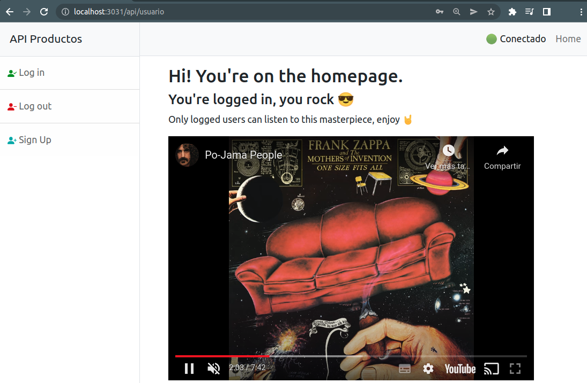
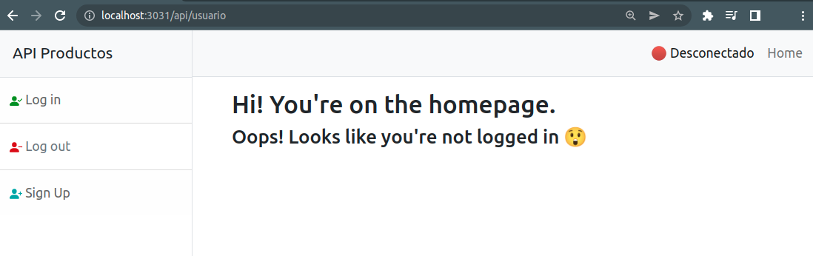
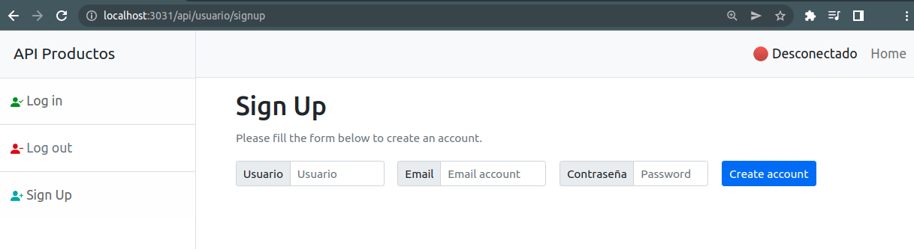
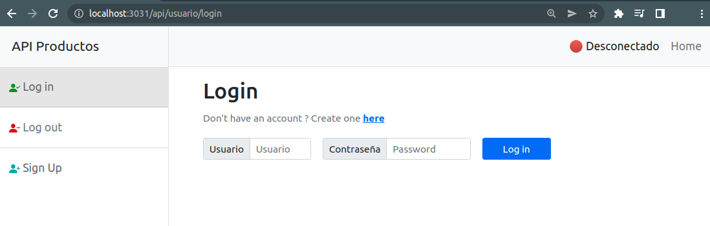
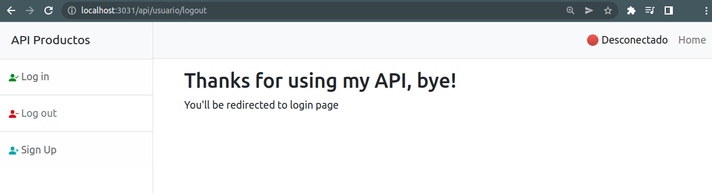

# Entrega Final

Esta entrega incluye lo realizado en las anteriores, para ver los detalles se pueden ver en cada README.

## Login, Logout y SignUp de usuario

### Home

En `/api/usuario`

- ✅ Si el usuario se encuentra loggeado:

- ❌ Si el usuario **no** se encuentra loggeado:

### Sign Up

En `/api/usuario/signup`

💡 Si se tiene configurada la cuenta de gmail y quitando el comentario de `user.controller.js:28` se recibirá un correo electrónico de que se ha creado un nuevo usuario.

### Log in

En `/api/usuario/login`

### Log out

En `/api/usuario/logout`

# Autor
Santiago Grinblat
